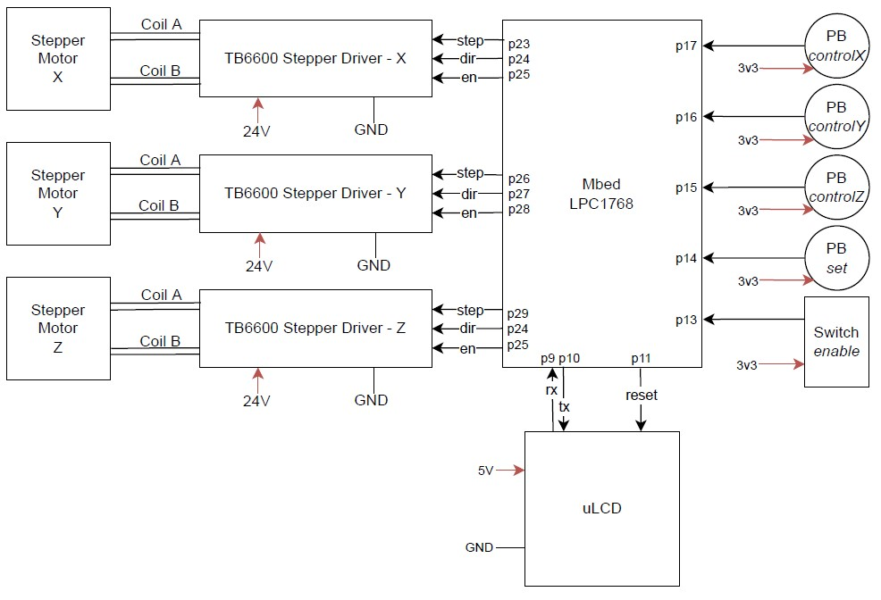

<h1 align="center">Cartesian Robot Mbed Library</h1>

<p align="center">
  <a href="#dart-about">About</a> &#xa0; | &#xa0; 
  <a href="#sparkles-features">Features</a> &#xa0; | &#xa0;
  <a href="#rocket-usagefunctionality">Usage/Functionality</a> &#xa0; | &#xa0;
  <a href="#checkered_flag-demo">Demo</a> &#xa0; | &#xa0;
  <a href="https://github.com/{{github}}" target="_blank">Author</a>
</p>

<br>

## :dart: About ##

An Mbed library to control cartesian robot stepper motors. The library features a thread-safe movement buffer and limit configuration methods. It can be used to control three-axis linear motion systems with a single function. 

## :sparkles: Features ##

:heavy_check_mark: Step/Direction/Enable motor driver compatability\
:heavy_check_mark: Limit configuration\
:heavy_check_mark: Stepper state maintenance\
:heavy_check_mark: Configurable acceleration/deceleration\
:heavy_check_mark: Single function control\
:heavy_check_mark: Thread-safe motion buffer management

## :rocket: Usage/Functionality ##
The library itself and the complete demo program can be found and imported into an Mbed Compiler on the official Mbed website here:
- [CartesianRobot](https://os.mbed.com/users/marcoanewman/code/CartesianRobot/)
- [Demo](https://os.mbed.com/users/marcoanewman/code/CartesianRobot_Demo/)

A block diagram of the demo hardware configuration has been included in this repository for reference:

<p align="center">
  
</p>
### Dependencies
This library requires that the official Mbed 2 C/C++ SDK and the Mbed Real Time Operating System be included in your project. They can be found on the official Mbed website. The revisions listed here have been validated to work:
- [mbed](https://os.mbed.com/users/mbed_official/code/mbed-rtos/) - 91:031413cf7a89
- [mbed-rtos](https://os.mbed.com/users/mbed_official/code/mbed-rtos/) - 52:02f5cf3

To support the 4DGL-uLCD used in the demo an additional library was included:
- [4DGL-uLCD-SE](https://os.mbed.com/users/4180_1/code/4DGL-uLCD-SE/) - 7:e39a44d

### Initialization
The CartesianRobot constructor requires 9 GPIOs
```c++
CartesianRobot robot(p22,p23,p24, p25,p26,p27, p28,p29,p30);
```
### Kill Switch
```c++
DigitalIn enable(p13);
void enable_switch(void const *args){
    while(1){
        if (!enable && robot.enabled())
            robot.disable();
        else if (enable && !robot.enabled())
            robot.enable();
    }
}

int main()
{
  ...
  enable.mode(PullDown);
  Thread t1(enable_switch);
  ...
}
```
### Position Monitoring
```c++
void position_monitor(void const *args){
    int x_pos, y_pos, z_pos;
    while(1){
        x_pos = robot.getXPosition()/8;
        y_pos = robot.getYPosition()/8;
        z_pos = robot.getZPosition()/8;
        // Report to Serial, uLCD, etc.
    }
}

int main()
{
    ...
    Thread t2(position_monitor);
    ...
}
```
### Configuration
```c++
int main()
{
    ...
    robot.setXSpeed(1200);
    robot.setYSpeed(1200);
    robot.setZSpeed(2400);
    robot.setXAcc(0);
    robot.setYAcc(0);
    robot.setZAcc(0);
    robot.setXDec(0);
    robot.setYDec(0);
    robot.setZDec(0);
    
    robot.startManager(); // Buffer Manager
    ...
}
```
### Limits
```c++
DigitalIn set(p14);
DigitalIn controlX(p15);
DigitalIn controlY(p16);
DigitalIn controlZ(p17);

int main()
{
    ...
    set.mode(PullDown);
    controlX.mode(PullDown);
    controlY.mode(PullDown);
    controlZ.mode(PullDown);

    while(!set);
    robot.setOrigin();

    while(!set){
        if (robot.stopped() && controlX)
            robot.moveX(80); // 10 steps
        if (robot.stopped() && controlY)
            robot.moveY(80); // 10 steps
        if (robot.stopped() && controlZ)
            robot.moveZ(80); // 10 steps   
    }
    robot.setLimits();
    ...
}
```
### Buffer Positions
```c++
Serial pc(USBTX,USBRX);

int main()
{
    int x, y, z;
    int x_s = 600;
    int y_s = 600;
    int z_s = 1000;
    while(1){
        if (pc.readable()){
            pc.scanf("%d,%d,%d", &x, &y, &z);
            pc.printf("Position Buffered\n");
            pc.printf("x=%d, y=%d, z=%d\n", x, y, z);
            // 1/8 microstepping
            robot.moveToXYZ(x*8,y*8,z*8,(float)x_s,(float)y_s,(float)z_s);
        }
    }
}
```

## :checkered_flag: Demo ##

<p align="center">
  <video src="https://youtu.be/vbTBneoq_78">
</p>

Made with :heart: by <a href="https://github.com/MarcoNewman" target="_blank">Marco Newman</a>

&#xa0;

<a href="#top">Back to top</a>